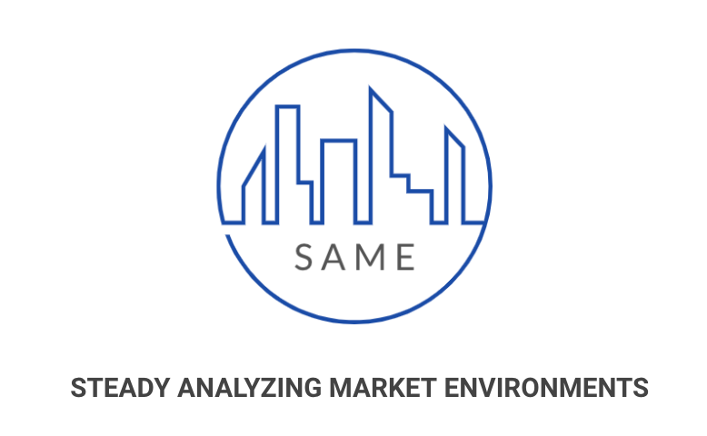
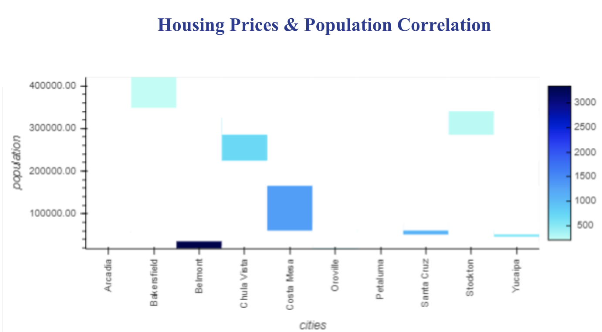
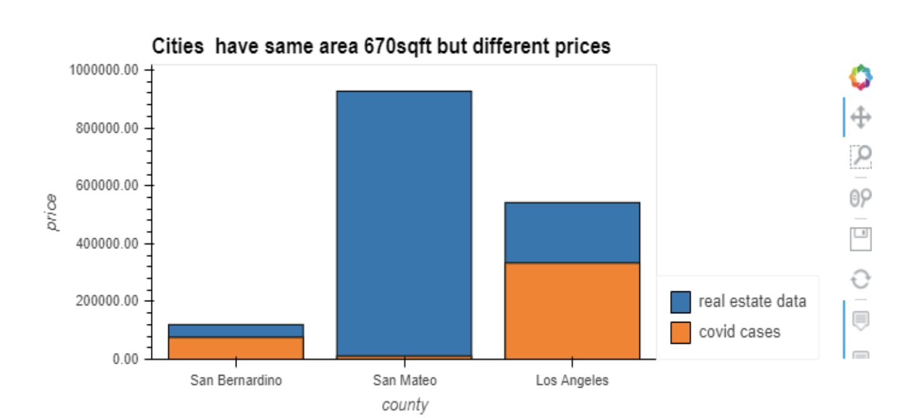
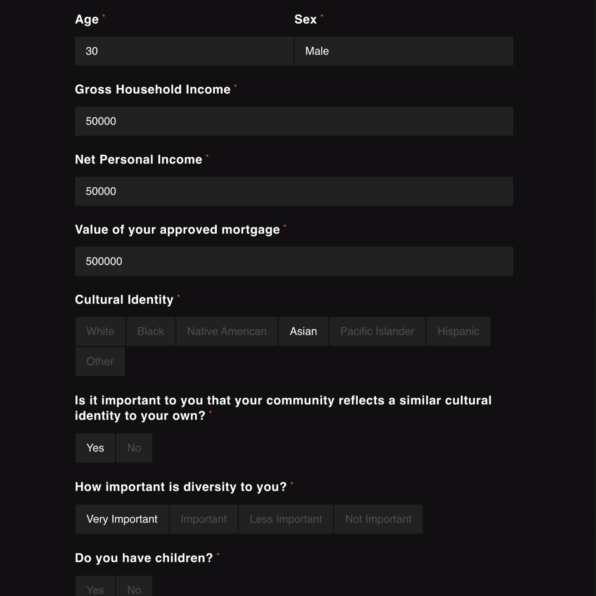
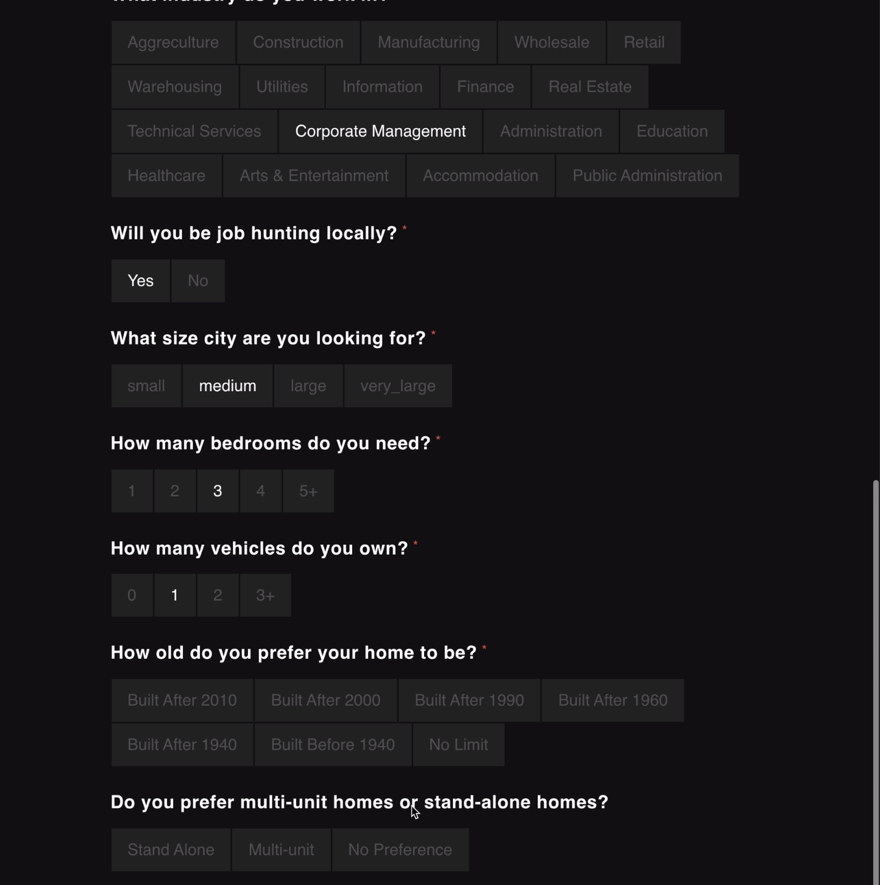
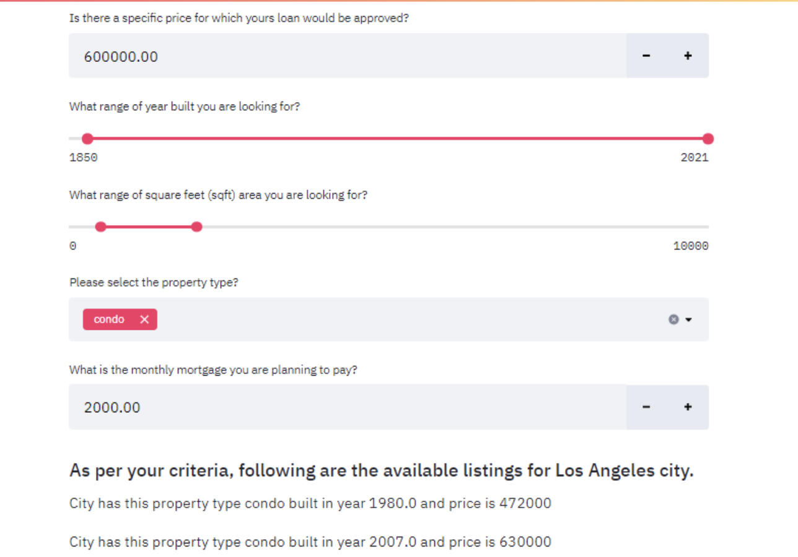

# SAME - The New PropTech In Town



SAME is a PropTech startup disrupting the way real estate investing is done. The world that we live in is changing, and with change comes great responsibility. Responsibility that requires innovation, which is the core of our business model. We make recommendations to our users based on their lifestyle and their financial goals. 

Our goal is to leverage our data-driven business model to educate and empower our users around Real Estate Investing. We provide users the research and analysis needed to decide whether you should sell, buy, or rent out a property. We are in an information era and knowledge is key. Which is why we are seeking a $250,000 (or 5 bitcoins) investment for 10% stake in our company, allowing us to give our  customers the key to investing in real estate, or the key to their next home. 

# Approach

The project analyzation is done in two parts -

1st part - Which city suits your lifestyle eg. whether you have any preference to live in any specific cultural community or diverse community?.

2nd part - Once we finalize the city, then we analyze why this city is best to invest financially?. 

There are so many parameters to financially analyze this, but we took only two parameters for this prototype. 
Ist parameters - we compared whether the user's mortgage is lesser then the historical city's average rent and 
the 2nd parameter - we compared whether expected real estate price is lesser then the city's average historical real estate price.

---

## Technologies

This project leverages python 3.7 with the following packages:

* [Pandas](https://pandas.pydata.org/) - For data cleaning, preparation and manipulation

* [Jupyter Notebook](https://jupyter.org/) - An open-source web application that allows you to create and share documents that contain live code, equations, visualizations and narrative text.

* [Visual Studio Code](https://code.visualstudio.com/) - A code editor redefined and optimized for building and debugging modern web and cloud applications

* [Fire](https://github.com/google/python-fire) - For the command line interface, help page, and entrypoint

* [Questionary](https://github.com/tmbo/questionary) - For interactive user prompts and dialogs

* [Pyviz](https://pyviz.org/) - Python visualization package that provides a single platform for accessing multiple visualization libraries. Two of these libraries are Plotly Express and hvPlot, which were used in this project

* [The Mapbox API](https://account.mapbox.com/auth/signup/) - To use the Mapbox API, you need to register for a public Mapbox API access token

* [Flask](https://flask.palletsprojects.com/en/1.1.x/) - A Python library which allows you to build a web application


---

## Installation Guide

Download Anaconda for your operating system and the latest Python version, run the installer, and follow the steps.

Before running the application first install the following dependencies.

```python
  pip install fire
  pip install questionary
  pip install pytest
  pip install pandas
  pip install numpy
  pip install flask
  pip install hvplot
```

To install PyViz and its dependencies in your Conda dev environment, complete the following steps:

1. From your terminal, log in to your Conda dev environment.

2. Install the PyViz packages by using the conda install command as follows:
    
	conda install -c plotly plotly=4.13.
    
    conda install -c pyviz hvplot
---

## Usage

After collecting, cleaning, and manipulating the data, you'll be able to visualize it in order to come up with a proper analysis. Example images provided below.  




As a user, you'll be able to input your lifestyle needs on a professionally completed dashboard: 




Then, the user will be able to input their financial goals in order for us to make a recommendation:




The final outcome should result in the following:

- A Jupyter notebook with an analysis and recommendation of the best city for the user's real estate investment

- Professionally styled and formatted interactive visualizations

- A dashboard that allows users to input their information and be given a recommendation on where to invest


---

## Contributors

Brought to you by Samual Prutton, Aruna Bisht, Matheus Araujo, Edgar Coronado

